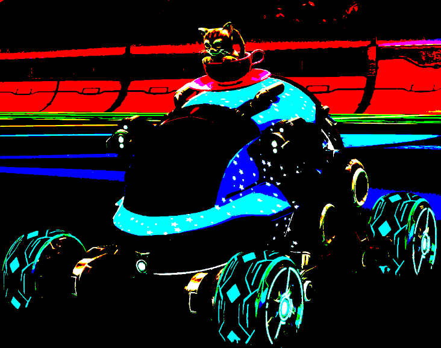
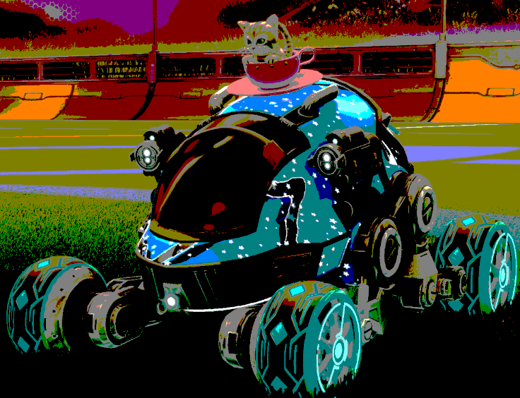
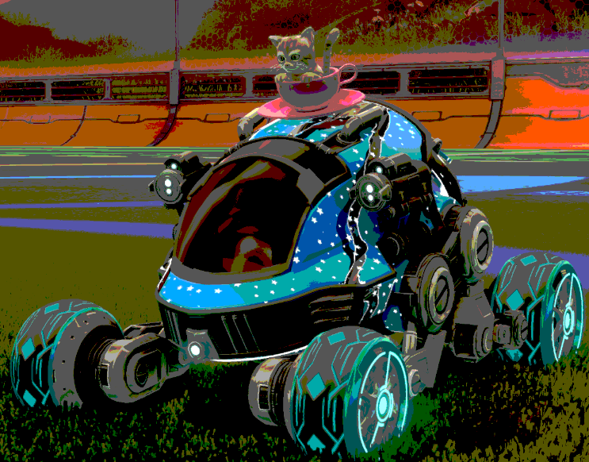
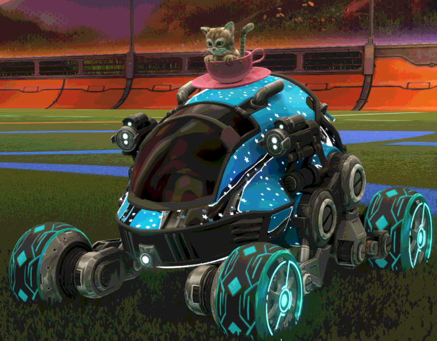

# OBS-shaders
crap obs shaders

bit_crush: Lets you drop the effective bit depth of a pixel. Change the CrushFactor value in the filter. Reasonable range of 1-128 whole numbers are recommended but you can use decimals.
 
 
 
 
 

