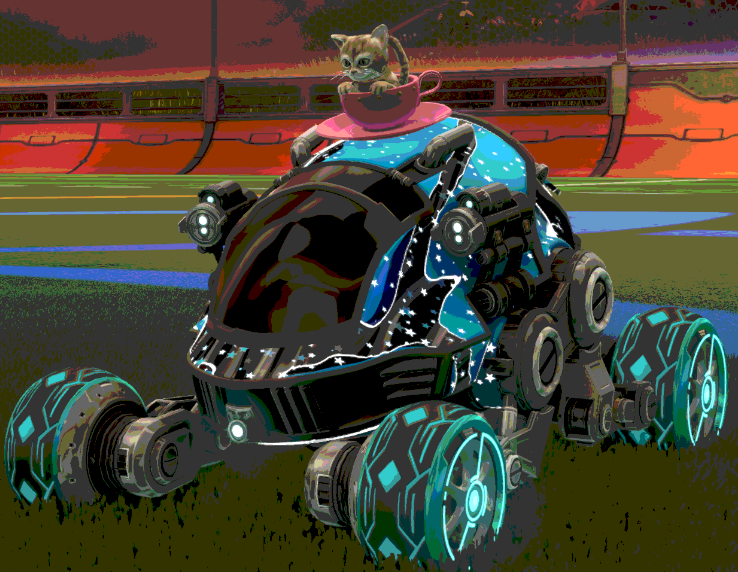

# OBS-shaders
crap obs shaders

bit_crush: Lets you drop the effective bit depth of a pixel. 

Change the CrushFactor value in the filter. 
Reasonable range of 1-128. Whole numbers are recommended but you can use decimals.

CrushFactor:1.0 

CrushFactor:2.0 
 

CrushFactor:3.0 
 

CrushFactor:5.0 
 

CrushFactor:10.0 

